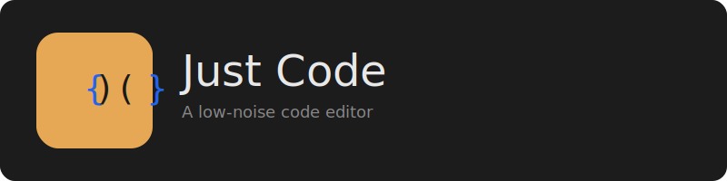

# Just Code Editor

A minimalist code editor for developers who just want to write code, without the visual noise.

## Philosophy

The name "Just Code" carries three intentional meanings:
1. "Just code already" - an imperative to get to work
2. "It's just code" - nothing else, no clutter, no noise
3. "Just" as in righteous - proper, well-crafted code

## Core Principles

- **Invisible until needed** - UI elements auto-hide and appear only on demand
- **Configuration as code** - Settings are JSON files edited in the editor itself
- **Minimal by default, powerful when needed** - Simple surface, depth available for those who seek it
- **No visual noise** - Every pixel on screen must earn its place

## Current Status

✅ **Phase 6 Complete** - Plugin System (Scripted) implemented!

### Key Features

#### Core Editing
- Clean, minimal dark-themed interface
- QScintilla-based editing with Python syntax highlighting
- **Multi-file editing** with tabs and session persistence
- **Markdown support** with split-pane preview (Ctrl+Shift+M)

#### Panel System
- **File Browser**: Project-focused view, bookmarks, auto-sync
- **Terminal**: Real bash terminal with command history, auto-syncs working directory
- Smooth slide animations for all panels

#### Configuration
- **Live Config Reload**: Settings update instantly when `settings.json` is saved
- **Theming**: 15+ UI themes and 11+ syntax themes included
- **Configuration as Code**: All settings managed via JSON files

#### Extensibility
- **Plugin System**: Supports both declarative (JSON) and scripted plugins
- **Scripting**: Write plugins in **Lua** or **Python**
- **Sandboxed Execution**: Safe environment for script execution
- **Triggers**: Run actions on save, on open, or via shortcuts

See [CHANGELOG.md](dev_docs/CHANGELOG-Master.md) for complete development log and roadmap.

## Installation

### Prerequisites
- Python 3.10+
- python3-venv

### Setup

1. Clone or navigate to the project directory
2. Run the setup script:
   ```bash
   ./setup.sh
   ```
   This will create a virtual environment and install all dependencies.

### Running Just Code

**Option 1: Use the run script** (recommended)
```bash
./run.sh
```

**Option 2: Manual activation**
```bash
source venv/bin/activate
python3 justcode/main.py
```

## Requirements

- Python 3.10+
- PyQt6
- QScintilla
- lupa (for Lua scripting)
- Black (for code formatting)

## Development

```bash
# Install dependencies
pip install -r requirements.txt

# Run the editor
python justcode/main.py
```

## License

*To be determined*

## Documentation

See [dev_docs/](dev_docs/) for detailed documentation:
- [Project Prompt](dev_docs/just-code-project-prompt.md)
- [Quick Reference](dev_docs/QUICKREF.md)
- [Master Changelog](dev_docs/CHANGELOG-Master.md)
